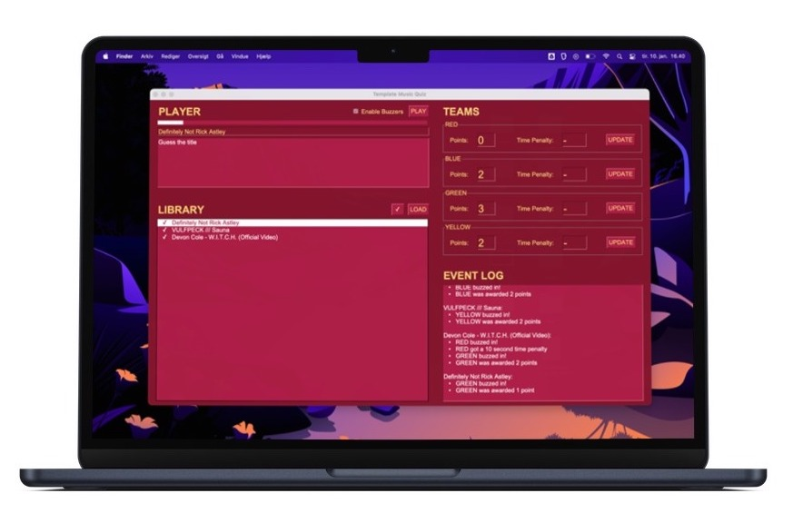
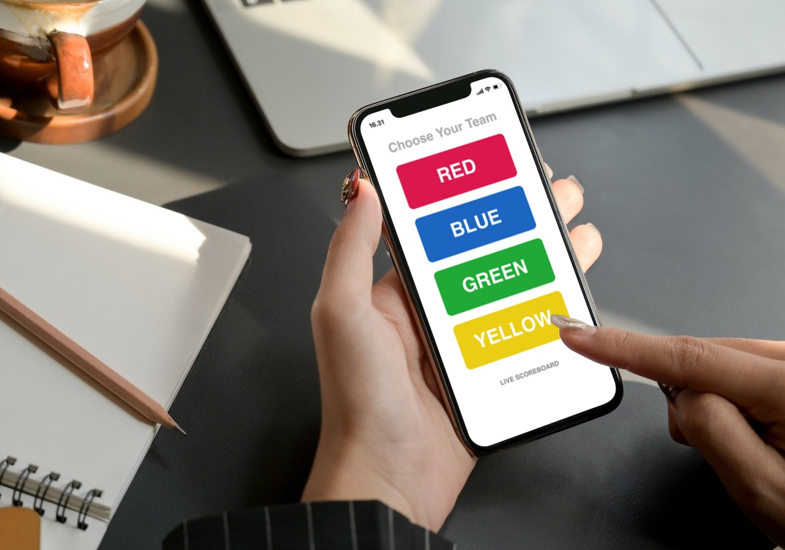
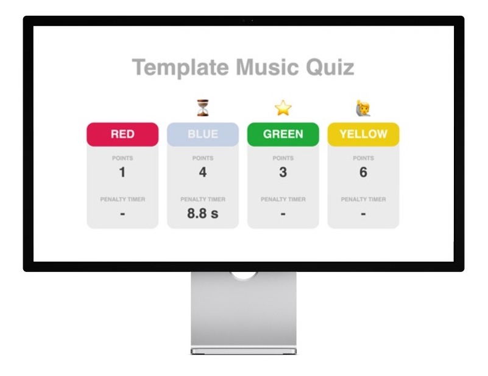

# YouQuiz
**A music quiz engine that transforms the good ol' music quiz concept into a fun game show for you and your friends.**

*YouQuiz* has features like buzzers, time penalties, sound effects and a live scoreboard. Anything available on *YouTube* can be used as material in the quiz, it doesn't even have to be music (maybe you would like to make a quiz about movie quotes?). A user-friendly GUI gives you (the quiz master) full control over the course of the battle.

Have fun!

# Installation
### 1. Tkinter
Python with `tkinter` is required. Installation depends on your platform and how you manage your Python installations. Here is an example for MacOS using Homebrew:
```bash
brew install python-tk
```

### 2. VLC
VLC Media Player is also needed. You can download an installer for your particular system from their [website](https://www.videolan.org/vlc/).

### 3. Python Packages
A couple of Python packages are needed. Install these via pip:
```
pip install -r requirements.txt
```

# Setup
A quiz is set up in a config-file written in YAML. A complete template can be found under `examples/template.yml`. Here is a minimal example (`examples/minimal.yml`):

```yml
songs:
  - url: https://youtu.be/9qoXa5_w3Gw
  - url: https://youtu.be/GjNY5HGcopA
  - url: https://youtu.be/dQw4w9WgXcQ
```

You now have a quiz setup containing these three songs. To launch *YouQuiz* with this configuration (in the project directory) run:
```shell
python3 youquiz examples/minimal.yml
```

This will launch the GUI and start a server on your local network. The first time you launch a specific configuration *YouQuiz* will first need to fetch all the songs from *YouTube*, which can take a up to a couple of minutes depending on your internet connection.



# Participating
For the participants to be able to join from their smartphones, they must be on the same Wi-Fi as the host running *YouQuiz*. The address they must navigate to is posted in the *Event Log*.




# Live Scoreboard
If you have another screen available, you can display a live scoreboard for the participants. It is not necessary for the quiz to work, but it surely adds to the experience.



# Advanced Setup
The complete template can be found under `examples/template.yml`.

### Songs
When adding songs to your configuration there are few optional parameters available. Here is an example using all of them: 
```yml
songs:
  - url: https://youtu.be/dQw4w9WgXcQ
    title: Definitely Not Rick Astley
    note: Guess the title
    start: 18.2 # in secondes
    stop: 125 # in seconds
```

### General Settings
If you want to customize you quiz even further, add a `settings` section to your config file. Here is an example using all optional parameters:
```yml
settings:
  title: My Music Quiz
  teams: 4 # choose between 2, 3 or 4
  penalty_time: 10 # in seconds
```

### Custom Buzzer Sounds
The buzzer for every team can be set to any sound you can find on *YouTube*, just like in the `songs` section. Simply add a `buzzers` section to your config file. Make sure to set a reasonable stop time so the sound doesn't play for more than a couple of seconds. Here is an example that sets a custom sound for the red team:
```yml
buzzers:
  red:
    url: https://youtu.be/L6aT_oEhIKo
    start: 0.1
    stop: 4
```


